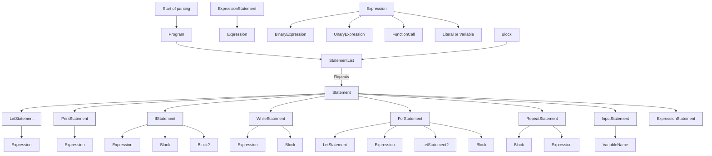

## Basic language parser

Handwritten top down recursive descent parser (LL1) with operator precedence handling and typed AST generation targeting a virtual machine IR.

- **Input:** list of tokens from tokenizer
- **Output:** root node 'ProgramNode', with AST
- **Errors:** drops `ParseException` with token position

Expressions parses by Precedence Climbing (smth as Pratt-parser)

