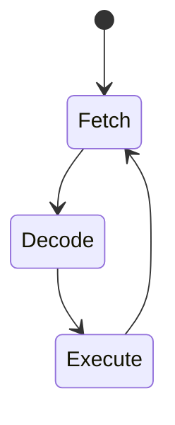

# MyBasicVM (стековая)

## Компоненты:
1. **Операндный стек** (максимум 1024 элемента)
   - Типы: int, float, string, bool
2. **Пул констант** (read-only)
3. **Хранилище переменных** (имя → значение)
4. **Call-стек** для вызовов функций
5. **Модуль heap** (для ссылочных типов: массивы, строки, объекты)
6. **Встроенные функции (native/system calls)** — math, time, io и др.
7. **Поддержка отладочной информации** (source map, IP → source line)
8. **Файловая система (FS API)** — базовый доступ к файлам через system calls
9. **Пользовательские типы (TYPE ... END TYPE)** — определение структур
10. **Поддержка версионности и расширяемости опкодов** (таблица инструкций с ревизией)

## Data stack
### Types
* int
* float
* string
* bool
* array (ref)
* struct (ref)
* null (optional)

### Depth 
1024 elements (configurable)

## Модель вызовов функций
- Передача аргументов через стек
- Аргументы извлекаются вручную в теле функции (`POP` → локальные переменные)
- Стек вызовов хранит IP и фрейм переменных
- Локальные переменные хранятся в фрейме

## Прочее:
- Файловый ввод/вывод (`file.read`, `file.write`, `file.exists`) — через system call
- Система ошибок (`HALT`, error codes, возможно THROW/CATCH в будущем)
- Типизация динамическая, но можно добавить TYPE/CHECK/CAST для стат. намёков
- Пользовательские типы через конструкции `TYPE MyStruct ... END TYPE`
- Константы — string/int/float/bool — помещаются в `.const` пул
- Поддержка модулей/импортов: `IMPORT "math.bas"` (планируется)

## Инструменты (в разработке):
- Отображение стека/фрейма в реальном времени
- Тест-раннер для байткодных программ

## Формат байткода (MyBasicBytecode v1)
- Заголовок: `0x4D 0x42 0x56 0x4D` + версия (1 байт)
- Секции: `.const`, `.code`, `.debug`, `.symbols`, `.types` (для TYPE), `.opcodes` (версионированная таблица инструкций)
- Представление инструкций: `[opcode: byte][args: variable]`

## Op Codes
| Hex | Mnemonic | Operands       | Stack Effect            | Description                          | Типы операндов          |
|-----|----------|----------------|-------------------------|--------------------------------------|-------------------------|
| 0x01 | PUSH    | const_idx      | → value                 | Push constant from pool              | int (индекс в пуле)     |
| 0x02 | POP     | -              | value →                 | Discard top value                    | -                       |
| 0x03 | DUP     | -              | a → a a                 | Duplicate top                        | -                       |
| 0x04 | SWAP    | -              | a b → b a               | Swap top two values                  | -                       |
| 0x05 | OVER    | -              | a b → a b a             | Copy second element to top           | -                       |
|     |          |                |                         |                                      |                         |
| 0x10 | ADD     | -              | a b → (a+b)             | Arithmetic +                         | int/float               |
| 0x11 | SUB     | -              | a b → (a-b)             | Arithmetic -                         | int/float               |
| 0x12 | MUL     | -              | a b → (a*b)             | Arithmetic *                         | int/float               |
| 0x13 | DIV     | -              | a b → (a/b)             | Arithmetic /                         | int/float               |
| 0x14 | MOD     | -              | a b → (a%b)             | Arithmetic %                         | int                     |
| 0x15 | NEG     | -              | a → (-a)                | Arithmetic negation                  | int/float               |
|     |          |                |                         |                                      |                         |
| 0x20 | AND     | -              | a b → (a&&b)            | Logical AND                          | bool                    |
| 0x21 | OR      | -              | a b → (a\|\|b)          | Logical OR                           | bool                    |
| 0x22 | NOT     | -              | a → (!a)                | Logical NOT                          | bool                    |
| 0x23 | CMP     | -              | a b → (a<=>b)           | Compare (-1/0/+1)                    | int/float/string        |
| 0x24 | EQ      | -              | a b → (a==b)            | Equality test                        | any                     |
| 0x25 | NEQ     | -              | a b → (a!=b)            | Not equal test                       | any                     |
|     |          |                |                         |                                      |                         |
| 0x30 | STORE   | var_idx        | value →                 | Store to variable                    | int (индекс переменной) |
| 0x31 | LOAD    | var_idx        | → value                 | Load variable                        | int (индекс переменной) |
| 0x32 | GSTORE  | global_idx     | value →                 | Store to global                      | int                     |
| 0x33 | GLOAD   | global_idx     | → value                 | Load global                          | int                     |
|     |          |                |                         |                                      |                         |
| 0x40 | JMP     | offset         | -                       | Relative jump                        | int (со знаком)         |
| 0x41 | JZ      | offset         | cond →                  | Jump if zero                         | int (со знаком)         |
| 0x42 | JNZ     | offset         | cond →                  | Jump if not zero                     | int (со знаком)         |
| 0x43 | CALL    | addr           | → ret_addr              | Call subroutine                      | int (абсолютный)        |
| 0x44 | RET     | -              | ret_addr →              | Return from call                     | -                       |
|     |          |                |                         |                                      |                         |
| 0x50 | PRINT   | -              | value →                 | Print top value                      | any                     |
| 0x51 | INPUT   | -              | → input                 | Read input as string                 | -                       |
| 0x52 | HALT    | -              | -                       | Stop execution                       | -                       |
| 0x53 | CONCAT  | -              | s1 s2 → s1+s2           | String concatenation                 | string                  |
| 0x54 | STRLEN  | -              | s → len(s)              | String length                        | string → int            |
| 0x55 | STRVAL  | -              | s → num(s)              | Convert string to number             | string → int/float      |
| 0x56 | SUBSTR  | start len      | s → substring           | Get substring                        | string → string         |
| 0x57 | STRCHR  | code           | → char                  | Convert ASCII to char                | int → string            |
| 0x58 | STRORD  | -              | char → code             | Get ASCII code of char               | string → int            |
|     |          |                |                         |                                      |                         |
| 0x60 | ARRAY   | size           | → array                 | Create array                         | int → array             |
| 0x61 | GETIDX  | -              | arr idx → value         | Array element read                   | array any → any         |
| 0x62 | SETIDX  | -              | arr idx value →         | Array element write                  | array any any →         |
| 0x63 | ARRLEN  | -              | arr → len               | Get array length                     | array → int             |
|     |          |                |                         |                                      |                         |
| 0x70 | TYPE    | -              | val → type_id           | Get type identifier                  | any → int               |
| 0x71 | CAST    | target_type    | val → converted_val     | Type conversion                      | any → any               |
| 0x72 | ISNUM   | -              | val → bool              | Check if number                      | any → bool              |
| 0x73 | ISSTR   | -              | val → bool              | Check if string                      | any → bool              |
| 0x80 | FSREAD   | path const_idx | → string              | Read file contents                   | string (path)           |
| 0x81 | FSWRITE  | path const_idx | content →             | Write string to file                 | string string           |
| 0x82 | FSEXISTS | path           | → bool                | Check if file exists                 | string                  |
| 0x83 | FSDELETE | path           | →                     | Delete file                          | string                  |
| 0x84 | FSAPPEND | path const_idx | content →             | Append string to file                | string string           |
## Модель вызовов функций
- Передача аргументов через стек
- Аргументы извлекаются вручную в теле функции (`POP` → локальные переменные)
- Стек вызовов хранит IP и фрейм переменных
- Локальные переменные хранятся в фрейме